# TodoList

## Documentation

### Use case diagram

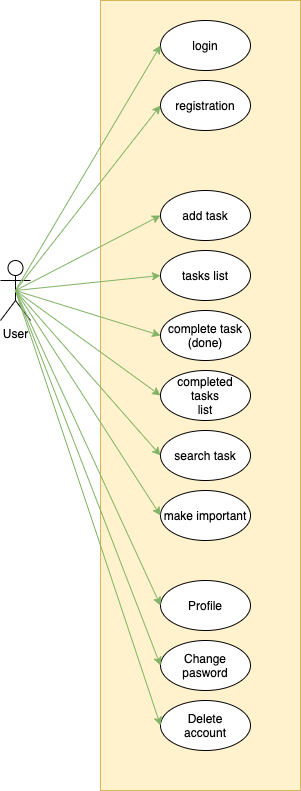

### User story mapping

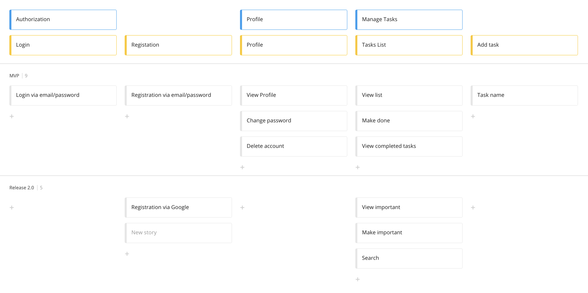

### Demo
[https://angular-todo-list-5447f.web.app/](https://angular-todo-list-5447f.web.app/)

### Screenshots
<a href="documentation/screenshots/login.png">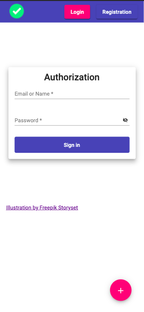</a>
<a href="documentation/screenshots/registration.png">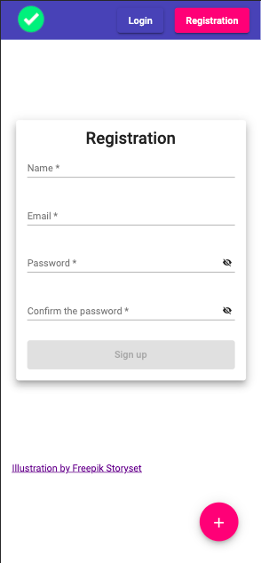</a>
<a href="documentation/screenshots/add-task.png">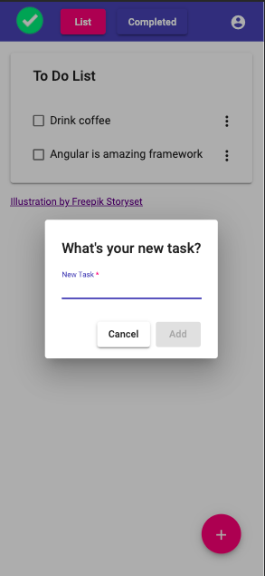</a>
<a href="documentation/screenshots/profile-menu.png">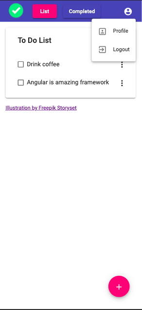</a>

<a href="documentation/screenshots/completed-page.png">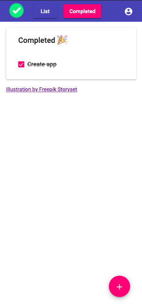</a>

<a href="documentation/screenshots/edit-task-menu.png">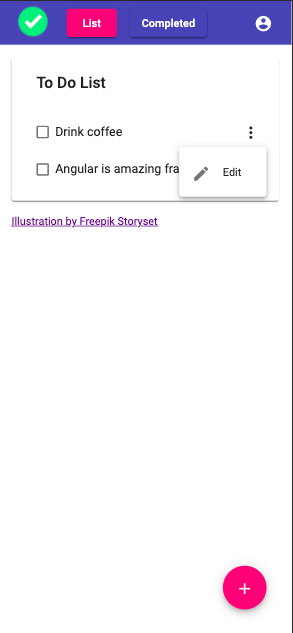</a>
<a href="documentation/screenshots/edit-task.png">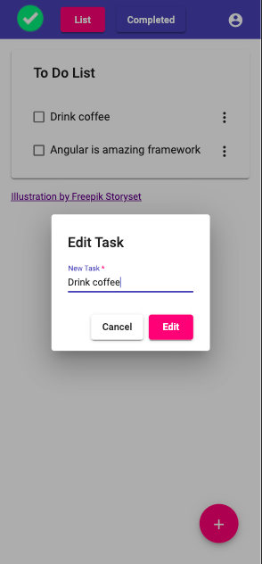</a>
<a href="documentation/screenshots/no-completed-task.png">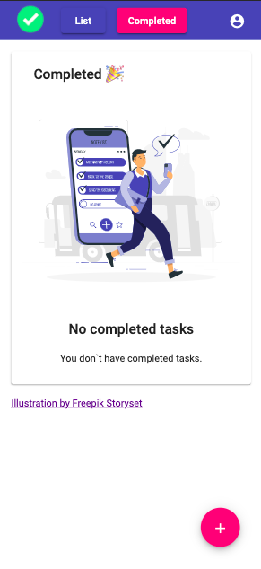</a>
<a href="documentation/screenshots/no-new-task.png">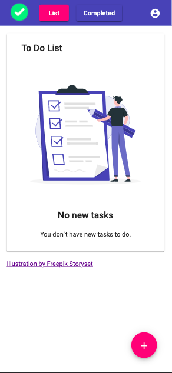</a>

## Info

This project was generated with [Angular CLI](https://github.com/angular/angular-cli) version 11.0.5.

## Development server

Run `ng serve` for a dev server. Navigate to `http://localhost:4200/`. The app will automatically reload if you change
any of the source files.

## Code scaffolding

Run `ng generate component component-name` to generate a new component. You can also
use `ng generate directive|pipe|service|class|guard|interface|enum|module`.

## Build

Run `ng build` to build the project. The build artifacts will be stored in the `dist/` directory. Use the `--prod` flag
for a production build.

## Running unit tests

Run `ng test` to execute the unit tests via [Karma](https://karma-runner.github.io).

## Running end-to-end tests

Run `ng e2e` to execute the end-to-end tests via [Protractor](http://www.protractortest.org/).

## Further help

To get more help on the Angular CLI use `ng help` or go check out
the [Angular CLI Overview and Command Reference](https://angular.io/cli) page.
