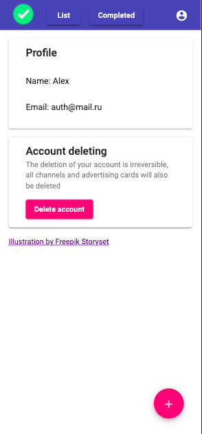
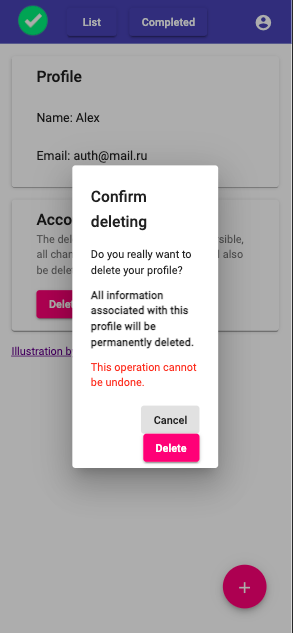

# TodoList

## Documentation

### Use case diagram

### User story mapping

### Screenshots

#### login

#### registration

#### add-task

#### profile-menu

#### profile-page

#### confirm-deleting

#### completed-page

#### list-page

#### edit-task-menu

#### edit-task

#### no-completed-task

#### no-new-task
 

### Demo
[https://angular-todo-list-5447f.web.app/](https://angular-todo-list-5447f.web.app/)

This project was generated with [Angular CLI](https://github.com/angular/angular-cli) version 11.0.5.

## Development server

Run `ng serve` for a dev server. Navigate to `http://localhost:4200/`. The app will automatically reload if you change
any of the source files.

## Code scaffolding

Run `ng generate component component-name` to generate a new component. You can also
use `ng generate directive|pipe|service|class|guard|interface|enum|module`.

## Build

Run `ng build` to build the project. The build artifacts will be stored in the `dist/` directory. Use the `--prod` flag
for a production build.

## Running unit tests

Run `ng test` to execute the unit tests via [Karma](https://karma-runner.github.io).

## Running end-to-end tests

Run `ng e2e` to execute the end-to-end tests via [Protractor](http://www.protractortest.org/).

## Further help

To get more help on the Angular CLI use `ng help` or go check out
the [Angular CLI Overview and Command Reference](https://angular.io/cli) page.
